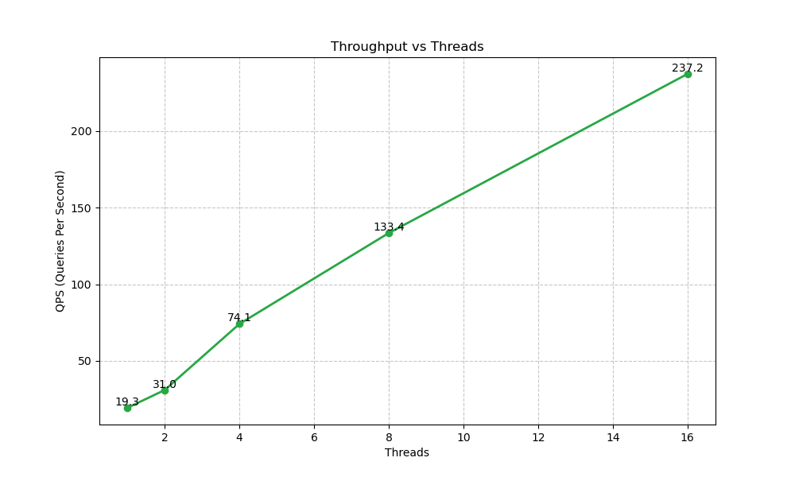
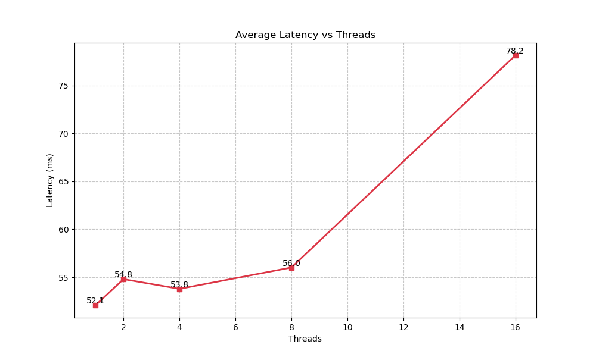

# InferBench-Linux 🚀

**InferBench-Linux** 是一个轻量级、高性能的 AI 模型推理与系统性能压测工具。它专为 Linux 环境设计，基于 ONNX Runtime C++ API 构建，旨在帮助开发者快速评估模型在特定硬件上的吞吐量 (QPS)、延迟 (Latency) 以及系统资源占用情况。


## ✨ 核心特性

*   **高性能推理**: 基于 Microsoft ONNX Runtime C++ API，采用 Zero-Copy 机制最小化内存开销。
*   **高并发压测**: 内置 `BenchmarkRunner`，支持多线程“抢单模式”并发推理，充分榨干 CPU 性能。
*   **资源熔断 (Watchdog)**: 支持设置内存上限 (`--memory_limit`)，防止 OOM 导致系统死机。
*   **模型探查 (Probe)**: 支持不运行推理直接查看模型输入输出结构 (`--probe`)。
*   **实时系统监控**: 直接解析 `/proc` 文件系统，以极低开销实时监控 CPU 使用率和物理内存 (RSS) 占用。
*   **专业报告输出**: 支持终端实时 ASCII 进度条与详细的 JSON 格式测试报告。
*   **自动化套件**: 提供 Python 绘图脚本 (`scripts/benchmark_suite.py`)，一键运行多线程压测并生成 Latency/Throughput 性能曲线图。
*   **可视化图表**: 自动生成 `throughput.png` (QPS vs Threads) 和 `latency.png` (Latency vs Threads) 以便直观分析扩展性。

## 🛠️ 构建指南

### 前置要求
*   Linux (Ubuntu 20.04/22.04 推荐) or WSL2
*   CMake >= 3.14
*   g++ (支持 C++17)
*   Git

### 编译步骤

1.  **克隆仓库**
    ```bash
    git clone https://github.com/your-username/InferBench-Linux.git
    cd InferBench-Linux
    ```

2.  **安装依赖 (ONNX Runtime)**
    项目包含自动脚本下载预编译好的 ONNX Runtime 库 (Linux x64)。
    ```bash
    # 脚本会自动下载并解压到 third_party 目录
    ./scripts/setup_deps.sh
    ```

3.  **编译项目**
    ```bash
    mkdir build && cd build
    cmake ..
    make -j$(nproc)
    ```

## 🚀 使用方法

编译完成后，可执行文件位于 `build/bin/inferbench`。

### 基本用法

```bash
./bin/inferbench --model <path_to_onnx_model> [OPTIONS]
```

### 参数说明

| 参数 | 缩写 | 默认值 | 说明 |
| :--- | :--- | :--- | :--- |
| `--model` | `-m` | (必填) | ONNX 模型文件路径 |
| `--threads` | `-t` | `1` | 并发推理线程数 |
| `--requests` | `-n` | `100` | 总请求次数 |
| `--warmup` | `-w` | `10` | 预热轮数 (不计入统计) |
| `--memory_limit` | `-l` | `0` (无) | 内存熔断限制 (MB)，超过即停止 |
| `--optimization` | `-o` | `all` | 图优化级别: `basic`, `all`, `none` |
| `--probe` | `-p` | (无) | 仅探查模型信息并退出，不运行推理 |
| `--json` | `-j` | (空) | 将结果保存为 JSON 文件的路径 |
| `--help` | `-h` | - | 显示帮助信息 |

### 运行示例

**示例 1: 使用 4 线程运行 ResNet50 跑 1000 次，并生成 JSON 报告**

```bash
./bin/inferbench -m ../tests/resnet50.onnx -t 4 -n 1000 -j report.json
```

**示例输出:**

```text
========================================
 InferBench-Linux 
========================================
Model: ../tests/resnet50.onnx
Threads: 4
Requests: 1000
...
----------------------------------------
 Benchmark Results 
----------------------------------------
QPS:            142.50
Avg Latency:    27.80 ms
P99 Latency:    55.10 ms
Avg CPU Usage:  385.20 %
Peak Memory:    315.50 MB
========================================
[Report] Saved to report.json
```

## 📂 项目结构

```
InferBench-Linux/
├── cmake/              # CMake 模块
├── include/            # 头文件 (SystemMonitor.h, InferenceEngine.h, etc.)
├── src/                # 源代码 (main.cpp, *.cpp)
├── tests/              # 单元测试与集成测试
├── scripts/            # 辅助脚本 (setup_deps.sh)
├── third_party/        # 第三方依赖 (onnxruntime, googletest)
├── CMakeLists.txt      # 构建配置
└── README.md           # 项目文档
```

## 🧪 运行测试

项目集成了 GoogleTest，用于验证各模块的正确性。

```bash
# 运行所有单元测试
cd build
./bin/unit_tests

# 运行自动化测试套件 (生成绘图)
./scripts/benchmark_suite.py --model ../tests/resnet50.onnx

# 运行内存泄漏检查 (ASan)
./scripts/mem_check.sh
```

### 📊 自动化压测与可视化

`scripts/benchmark_suite.py` 是一个强大的工具，它可以自动执行一系列不同线程数（默认 1, 2, 4, 8, 16）的基准测试，并生成直观的性能图表。

**使用方法:**

```bash
# 确保已安装 python3 和 matplotlib
# sudo apt install python3-matplotlib

# 运行自动化套件 (默认 requests=100 per thread)
./scripts/benchmark_suite.py --model ../tests/resnet50.onnx --requests 50
```

**输出产物:**

1.  **`throughput.png`**: 展示系统吞吐量 (QPS) 随并发线程数增加的变化趋势。
    *   *分析要点*: 观察曲线何时变平（Saturation Point），即为硬件的最大处理能力。
2.  **`latency.png`**: 展示平均推理延迟随并发线程数增加的变化趋势。
    *   *分析要点*: 用于评估在不同负载下的响应速度稳定性。

**可视化效果示例:**

### Throughput (QPS) vs Threads


### Latency (ms) vs Threads


## 📄 License

MIT License
